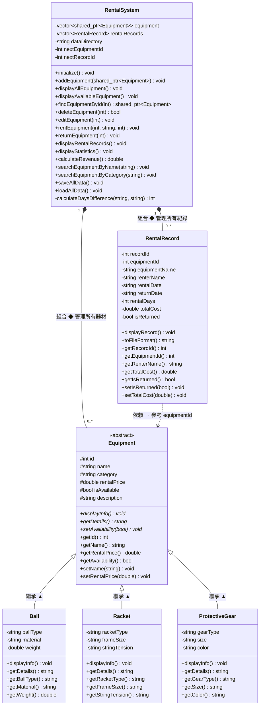

# 體育器材租借系統 - 架構設計文檔

## 🏗️ 架構概覽

體育器材租借系統採用分層架構設計，主要由以下幾層組成：

```
┌─────────────────────────────────────────────┐
│           表現層 (UI Layer)                  │
│         RentalSystemUI 類                   │
├─────────────────────────────────────────────┤
│         業務邏輯層 (Business Logic)          │
│    RentalSystem 類（核心管理類）            │
├─────────────────────────────────────────────┤
│         領域模型層 (Domain Model)            │
│  Equipment, Ball, Racket, ProtectiveGear   │
│         RentalRecord                        │
├─────────────────────────────────────────────┤
│         數據持久化層 (Data Layer)            │
│      CSV 文件讀寫操作                       │
└─────────────────────────────────────────────┘
```

---

## 🗂️ UML 類別關係圖



| 符號 | 關係 | 說明 |
|------|------|------|
| `<\|--` 實線三角 | **繼承** | Ball / Racket / ProtectiveGear → Equipment |
| `*--` 實心菱形 | **組合** | RentalSystem 擁有並管理子物件 |
| `..>` 虛線箭頭 | **依賴** | RentalRecord 透過 `equipmentId` 參考 Equipment |

---

## 📦 組件設計

### 1. 領域模型層（Domain Model Layer）

#### Equipment 基類
```
Equipment
│
├─ Attributes:
│  ├─ id: int               (器材唯一標識)
│  ├─ name: string          (器材名稱)
│  ├─ category: string      (分類)
│  ├─ rentalPrice: double   (租借價格)
│  ├─ isAvailable: bool     (可用狀態)
│  └─ description: string   (描述)
│
├─ Virtual Methods:
│  ├─ displayInfo()         (顯示信息)
│  ├─ getDetails()          (獲取詳情)
│  └─ setAvailability()     (設置可用性)
│
└─ Getters/Setters:
   └─ [所有屬性的訪問器]
```

#### Ball 衍生類
```
Ball extends Equipment
│
├─ Additional Attributes:
│  ├─ ballType: string      (球類型)
│  ├─ material: string      (材料)
│  └─ weight: double        (重量)
│
├─ Overridden Methods:
│  ├─ displayInfo()         (球類特定顯示)
│  └─ getDetails()          (球類特定詳情)
│
└─ Getters/Setters:
   └─ [球類特定屬性的訪問器]
```

#### Racket 衍生類
```
Racket extends Equipment
│
├─ Additional Attributes:
│  ├─ racketType: string    (拍類型)
│  ├─ frameSize: string     (拍面大小)
│  └─ stringTension: string (弦張力)
│
├─ Overridden Methods:
│  ├─ displayInfo()         (拍類特定顯示)
│  └─ getDetails()          (拍類特定詳情)
│
└─ Getters/Setters:
   └─ [拍類特定屬性的訪問器]
```

#### ProtectiveGear 衍生類
```
ProtectiveGear extends Equipment
│
├─ Additional Attributes:
│  ├─ gearType: string      (裝備類型)
│  ├─ size: string          (尺寸)
│  └─ color: string         (顏色)
│
├─ Overridden Methods:
│  ├─ displayInfo()         (裝備特定顯示)
│  └─ getDetails()          (裝備特定詳情)
│
└─ Getters/Setters:
   └─ [裝備特定屬性的訪問器]
```

#### RentalRecord 類
```
RentalRecord
│
├─ Attributes:
│  ├─ recordId: int         (紀錄 ID)
│  ├─ equipmentId: int      (器材 ID)
│  ├─ equipmentName: string (器材名稱)
│  ├─ renterName: string    (租借人)
│  ├─ rentalDate: string    (租借日期)
│  ├─ returnDate: string    (應歸還日期)
│  ├─ rentalDays: int       (天數)
│  ├─ totalCost: double     (總費用)
│  └─ isReturned: bool      (是否已歸還)
│
├─ Methods:
│  ├─ displayRecord()       (顯示紀錄)
│  └─ toFileFormat()        (轉換為文件格式)
│
└─ Getters/Setters:
   └─ [所有屬性的訪問器]
```

### 2. 業務邏輯層（Business Logic Layer）

#### RentalSystem 類

**核心責任**
- 管理器材集合
- 管理租借紀錄
- 實現業務規則
- 數據持久化

**主要模塊**

```
RentalSystem
│
├─ 1. Equipment Management（器材管理）
│  ├─ addEquipment()           (添加器材)
│  ├─ deleteEquipment()        (刪除器材)
│  ├─ findEquipmentById()      (查找器材)
│  ├─ editEquipment()          (編輯器材)
│  ├─ displayAllEquipment()    (顯示所有)
│  └─ displayAvailableEquipment() (顯示可租)
│
├─ 2. Rental Management（租借管理）
│  ├─ rentEquipment()          (租借)
│  ├─ returnEquipment()        (歸還)
│  ├─ displayRentalRecords()   (顯示紀錄)
│  └─ displayUserRentals()     (用戶租借)
│
├─ 3. Search & Query（搜索查詢）
│  ├─ searchEquipmentByName()     (按名稱)
│  └─ searchEquipmentByCategory() (按分類)
│
├─ 4. Analytics（統計分析）
│  ├─ displayStatistics()      (統計信息)
│  └─ calculateRevenue()       (收入計算)
│
├─ 5. File Operations（文件操作）
│  ├─ saveEquipmentToFile()    (保存器材)
│  ├─ loadEquipmentFromFile()  (加載器材)
│  ├─ saveRentalRecordsToFile() (保存紀錄)
│  ├─ loadRentalRecordsFromFile() (加載紀錄)
│  ├─ saveAllData()            (全部保存)
│  └─ loadAllData()            (全部加載)
│
└─ 6. Utilities（工具方法）
   ├─ getCurrentDate()         (獲取當前日期)
   ├─ addDaysToDate()          (日期計算)
   └─ calculateDaysDifference() (日期差)
```

### 3. 表現層（UI Layer）

#### RentalSystemUI 類

**菜單結構**
```
Main Menu (主菜單)
├─ 查看所有器材
├─ 查看可租借器材
├─ Equipment Management Menu (器材管理)
│  ├─ 添加器材
│  │  └─ 選擇器材類型
│  │     ├─ 球類
│  │     ├─ 拍類
│  │     └─ 保護裝備
│  ├─ 編輯器材
│  └─ 刪除器材
├─ Rental Management Menu (租借管理)
│  ├─ 租借器材
│  ├─ 歸還器材
│  ├─ 查看所有紀錄
│  └─ 查看用戶紀錄
├─ Search Menu (搜索)
│  ├─ 按名稱搜索
│  └─ 按分類搜索
├─ 統計信息
└─ 退出系統
```

**UI 組件**
- `displayMainMenu()` - 主菜單顯示
- `displayEquipmentMenu()` - 器材菜單
- `displayRentalMenu()` - 租借菜單
- `displaySearchMenu()` - 搜索菜單
- `clearScreen()` - 清屏
- `pressAnyKeyToContinue()` - 暫停提示

### 4. 數據持久化層（Data Layer）

**文件結構**
```
data/
├─ equipment.csv       (器材數據)
└─ rental_records.csv  (租借紀錄)
```

**CSV 格式**

Equipment CSV:
```
ID,名稱,分類,價格,狀態,類型,詳細信息
1,籃球,球類,50.0,可租,球類-籃球|材料:橡膠|重量:600g|$50
```

Rental Record CSV:
```
紀錄ID,器材ID,器材名稱,租借人,租借日期,歸還日期,天數,費用,已歸還
1,1,籃球,張三,2024-01-01,2024-01-03,2,100.0,1
```

## 🔄 工作流設計

### 租借流程

```
用戶選擇租借
    ↓
顯示可租借器材列表
    ↓
用戶選擇器材 ID
    ↓
輸入租借人名稱
    ↓
輸入租借天數
    ↓
系統驗證器材可用性
    ├─ NO: 顯示錯誤，返回菜單
    └─ YES: 繼續
    ↓
計算應歸還日期（current + days）
    ↓
計算總費用（price × days）
    ↓
創建 RentalRecord 對象
    ↓
更新器材狀態為 "已租"
    ↓
添加紀錄到列表
    ↓
保存數據到文件
    ↓
顯示成功信息
```

### 歸還流程

```
用戶選擇歸還
    ↓
顯示所有租借紀錄
    ↓
用戶輸入紀錄 ID
    ↓
查找紀錄
    ├─ NOT FOUND: 顯示錯誤
    └─ FOUND: 繼續
    ↓
驗證紀錄狀態
    ├─ 已歸還: 提示已歸還
    └─ 租借中: 繼續
    ↓
更新歸還日期（current date）
    ↓
更新狀態為 "已歸還"
    ↓
查找對應器材
    ↓
更新器材狀態為 "可租"
    ↓
保存數據到文件
    ↓
顯示成功信息
```

## 📊 數據結構設計

### 器材容器
```cpp
std::vector<std::shared_ptr<Equipment>> equipment;
```
- 使用 vector 支持動態增長
- 使用 shared_ptr 實現多態和自動內存管理
- 支持三種不同類型的派生類

### 租借紀錄容器
```cpp
std::vector<RentalRecord> rentalRecords;
```
- 使用 vector 存儲租借紀錄
- 簡單直接的數據結構

### ID 生成
```cpp
int nextEquipmentId;    // 下一個器材 ID
int nextRecordId;       // 下一個紀錄 ID
```
- 自動遞增
- 保證唯一性

## 🔌 接口設計

### 公開接口（Public Interfaces）

#### Equipment 相關
```cpp
void addEquipment(shared_ptr<Equipment> equip);
void displayAllEquipment() const;
void displayAvailableEquipment() const;
shared_ptr<Equipment> findEquipmentById(int id) const;
bool deleteEquipment(int id);
void editEquipment(int id);
```

#### 租借相關
```cpp
void rentEquipment(int equipmentId, const string& renterName, int rentalDays);
void returnEquipment(int recordId);
void displayRentalRecords() const;
void displayUserRentals(const string& renterName) const;
```

#### 搜索相關
```cpp
void searchEquipmentByName(const string& name) const;
void searchEquipmentByCategory(const string& category) const;
```

#### 統計相關
```cpp
void displayStatistics() const;
double calculateRevenue() const;
```

#### 文件相關
```cpp
void saveAllData();
void loadAllData();
```

## 🔐 設計模式使用

### 1. 繼承模式（Inheritance Pattern）
- Equipment 基類定義通用接口
- 衍生類實現特定功能
- 支持多態性

### 2. 策略模式（Strategy Pattern）
- 不同器材類型有不同的 `displayInfo()` 實現
- 在運行時選擇合適的策略

### 3. 容器管理模式（Container Management）
- vector 容器管理器材集合
- 統一的 CRUD 操作接口

### 4. 智能指針模式（Smart Pointer Pattern）
- shared_ptr 自動管理內存
- 避免內存洩漏

## 💾 數據流

### 添加器材流程
```
Input (用戶輸入)
    ↓
Create Equipment Object (創建對象)
    ↓
addEquipment() method (添加到容器)
    ↓
Set ID (自動生成 ID)
    ↓
saveEquipmentToFile() (保存到文件)
    ↓
Output (顯示成功)
```

### 加載數據流程
```
Initialize System (系統初始化)
    ↓
loadAllData() (加載所有數據)
    ├─ Check Files (檢查文件)
    ├─ Read CSV (讀取 CSV)
    ├─ Parse Data (解析數據)
    ├─ Create Objects (創建對象)
    └─ Add to Container (添加到容器)
    ↓
System Ready (系統就緒)
```

## 🚀 性能考慮

### 時間複雜度
- `findEquipmentById()` - O(n) 線性搜索
- `addEquipment()` - O(1) 尾部插入
- `deleteEquipment()` - O(n) 需要查找
- `displayAllEquipment()` - O(n) 遍歷

### 優化空間
- 使用 map 優化 ID 查找 → O(log n)
- 使用索引優化刪除操作 → O(1)
- 緩存統計結果 → 減少重複計算

## 🔒 安全性考慮

### 內存安全
- 使用 shared_ptr 防止內存洩漏
- 容器自動管理元素生命週期

### 數據完整性
- 文件保存前驗證數據
- 加載時進行格式檢查

### 異常處理
- 文件打開失敗捕捉
- 無效輸入驗證

## 📈 可擴展性

### 易於添加新功能
- 菜單系統易於擴展
- 新器材類型只需繼承 Equipment

### 易於修改
- 分層設計便於隔離修改
- 接口穩定不易變化

### 易於測試
- 模塊化設計
- 可獨立測試各個組件

---

**文檔版本**：1.0
**最後更新**：2024年
