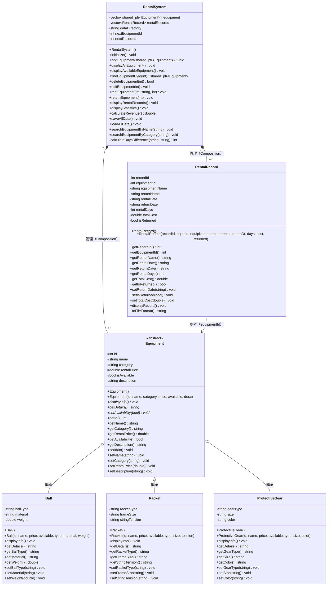

# 類別圖與架構說明

> 體育器材租借系統 — Class Diagram & Architecture

---

## 類別圖 (UML Class Diagram)



---

## 類別關係說明

### 1. 繼承關係（Inheritance）

```
Equipment  ◁───────  Ball
           ◁───────  Racket
           ◁───────  ProtectiveGear
```

| 父類 | 子類 | 說明 |
|------|------|------|
| `Equipment` | `Ball` | 球類器材，新增 `ballType`、`material`、`weight` 屬性 |
| `Equipment` | `Racket` | 拍類器材，新增 `racketType`、`frameSize`、`stringTension` 屬性 |
| `Equipment` | `ProtectiveGear` | 保護裝備，新增 `gearType`、`size`、`color` 屬性 |

- `Equipment` 為**抽象基類**，定義所有器材的共同介面
- 三個子類皆 **override** `displayInfo()` 與 `getDetails()` 虛擬方法（多型）
- 子類以 `public` 繼承，完整繼承父類的 `protected` 成員

---

### 2. 組合關係（Composition）

```
RentalSystem  ◆──── vector<shared_ptr<Equipment>>
              ◆──── vector<RentalRecord>
```

| 容器類 | 包含類 | 關係 | 說明 |
|--------|--------|------|------|
| `RentalSystem` | `Equipment`（子類） | 組合 1 對多 | 用 `shared_ptr` 儲存多型指標，統一管理所有器材 |
| `RentalSystem` | `RentalRecord` | 組合 1 對多 | 以 `vector` 儲存所有租借紀錄 |

- `RentalSystem` 負責**全系統的生命週期管理**，器材與紀錄隨系統銷毀而釋放

---

### 3. 依賴關係（Dependency）

```
RentalRecord  ─ ─ ─ ▷  Equipment（透過 equipmentId 參考）
```

- `RentalRecord` 透過 `equipmentId`（int）間接參考 `Equipment`
- 屬於**鬆耦合**設計，紀錄不直接持有器材指標，僅記錄 ID 與名稱

---

### 4. 多型（Polymorphism）

`RentalSystem` 以 `shared_ptr<Equipment>` 統一持有所有子類，呼叫：
```cpp
equip->displayInfo();   // 依實際型別呼叫 Ball / Racket / ProtectiveGear 的版本
equip->getDetails();    // 同上
```

虛擬方法分派表（Virtual Dispatch）：

| 方法 | Equipment（基類） | Ball | Racket | ProtectiveGear |
|------|-----------------|------|--------|---------------|
| `displayInfo()` | virtual | override ✅ | override ✅ | override ✅ |
| `getDetails()` | virtual | override ✅ | override ✅ | override ✅ |
| `setAvailability()` | virtual | 繼承 | 繼承 | 繼承 |

---

### 5. 架構總覽

```
┌─────────────────────────────────────────────────────┐
│                    main.cpp                         │
│              （程式入口 / UI 選單）                  │
└─────────────────────┬───────────────────────────────┘
                      │ 使用
                      ▼
┌─────────────────────────────────────────────────────┐
│                 RentalSystem                        │
│         （系統核心：器材管理 + 租借管理）             │
│                                                     │
│  ┌─────────────────────────────────────────────┐   │
│  │  vector<shared_ptr<Equipment>>              │   │
│  │  ┌──────────┐ ┌────────┐ ┌───────────────┐  │   │
│  │  │   Ball   │ │Racket  │ │ProtectiveGear │  │   │
│  │  └──────────┘ └────────┘ └───────────────┘  │   │
│  │         ▲           ▲              ▲         │   │
│  │         └───────────┴──────────────┘         │   │
│  │                 Equipment                    │   │
│  └─────────────────────────────────────────────┘   │
│                                                     │
│  ┌─────────────────────────────────────────────┐   │
│  │  vector<RentalRecord>                       │   │
│  │  ┌──────────────────────────────────────┐   │   │
│  │  │  recordId / equipmentId / renterName │   │   │
│  │  │  rentalDate / returnDate / totalCost │   │   │
│  │  └──────────────────────────────────────┘   │   │
│  └─────────────────────────────────────────────┘   │
└─────────────────────────────────────────────────────┘
                      │ 讀寫
                      ▼
              ┌───────────────┐
              │  data/ 目錄   │
              │ equipment.csv │
              │rental_records │
              │    .csv       │
              └───────────────┘
```

---

## OOP 設計原則對應

| 原則 | 實作方式 |
|------|----------|
| **封裝（Encapsulation）** | 所有屬性為 `private`/`protected`，透過 getter/setter 存取 |
| **繼承（Inheritance）** | `Ball`、`Racket`、`ProtectiveGear` 繼承 `Equipment` |
| **多型（Polymorphism）** | `displayInfo()` 與 `getDetails()` 為虛擬方法，子類 override |
| **抽象（Abstraction）** | `Equipment` 定義通用介面，隱藏子類實作細節 |
