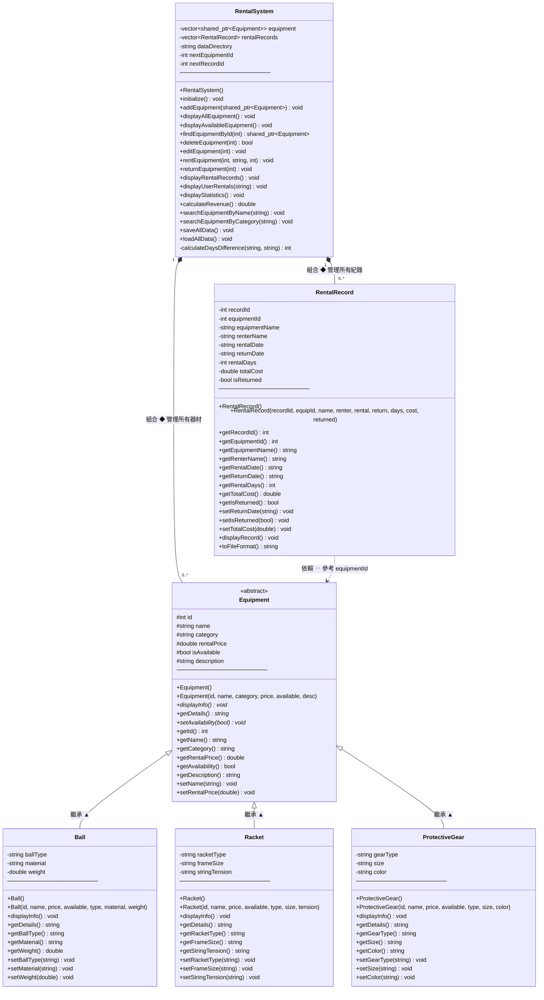

# 類別圖與架構說明

> 體育器材租借系統（Sports Equipment Rental System）— UML Class Diagram

---

## 完整類別關係圖



---

## 關係類型說明

| 符號 | 關係類型 | 本系統中的例子 |
|------|----------|----------------|
| `<\|--` （▲實線） | **繼承 Inheritance** | `Ball`、`Racket`、`ProtectiveGear` 繼承 `Equipment` |
| `*--` （◆實線） | **組合 Composition** | `RentalSystem` 擁有並管理 `Equipment` 與 `RentalRecord` |
| `..>` （虛線箭頭） | **依賴 Dependency** | `RentalRecord` 透過 `equipmentId` 間接參考 `Equipment` |

---

## 繼承層次（Inheritance Hierarchy）

```
Equipment  ← 抽象基類，定義所有器材的共同介面
├── Ball           （球類：籃球、足球、網球 ...）
│       新增屬性：ballType / material / weight
├── Racket         （拍類：羽毛球拍、桌球拍 ...）
│       新增屬性：racketType / frameSize / stringTension
└── ProtectiveGear （護具：頭盔、護膝、護腕 ...）
        新增屬性：gearType / size / color
```

三個子類皆 **override** 以下虛擬方法（實現多型）：

| 方法 | Equipment | Ball | Racket | ProtectiveGear |
|------|:---------:|:----:|:------:|:--------------:|
| `displayInfo()` | `virtual` | `override` | `override` | `override` |
| `getDetails()` | `virtual` | `override` | `override` | `override` |
| `setAvailability()` | `virtual` | ─（繼承） | ─（繼承） | ─（繼承） |

---

## 組合關係（Composition）

`RentalSystem` 以 **smart pointer** 統一管理所有資源：

```cpp
// 多型容器：以基類指標持有所有子類實例
vector<shared_ptr<Equipment>> equipment;

// 存放所有租借紀錄
vector<RentalRecord> rentalRecords;
```

- 所有 `Equipment` 子類（Ball / Racket / ProtectiveGear）透過 `shared_ptr<Equipment>` 儲存
- 呼叫 `equip->displayInfo()` 時，自動執行對應子類的版本（**動態分派**）

---

## 資料流向

```
main.cpp
   │
   │ 建立並操作
   ▼
RentalSystem
   │                          ┌──────────────────────────────┐
   ├─◆── equipment ──────────▶│ shared_ptr<Equipment>        │
   │                          │   可以是 Ball / Racket /      │
   │                          │   ProtectiveGear（多型）      │
   │                          └──────────────────────────────┘
   │
   ├─◆── rentalRecords ──────▶ RentalRecord
   │                               │
   │                               │ equipmentId（外鍵參考）
   │                               └──────────────▶ Equipment
   │
   └─ 讀寫 ──▶ data/equipment.csv
              data/rental_records.csv
```

---

## OOP 四大原則

| 原則 | 實作方式 |
|------|----------|
| **封裝（Encapsulation）** | 屬性宣告為 `private`/`protected`，僅透過 getter/setter 存取 |
| **繼承（Inheritance）** | `Ball`、`Racket`、`ProtectiveGear` 以 `public` 繼承 `Equipment` |
| **多型（Polymorphism）** | `displayInfo()` 與 `getDetails()` 為 `virtual`，子類 `override` |
| **抽象（Abstraction）** | `Equipment` 定義通用介面，隱藏各子類的實作細節 |
